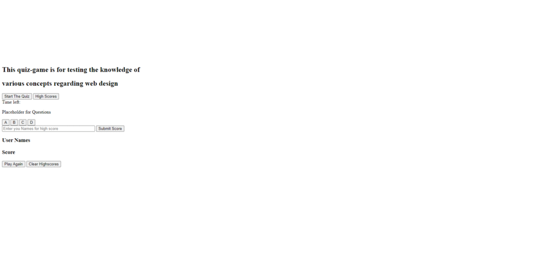

# The web design Quiz

This is a project targeted for the assignment ( or homework) for Western Australia's UWA Bootcamp

This is a web app focussing on Javascript (local storage) to create a quiz game . 

This has been deployed to GitHub. To get this web app ( or project) up and running, one can follow the link(deployment).one can also download the file to use as template.
 
* [GitHub Repository](https://github.com/citenaresh/Code-Quiz/): https://github.com/citenaresh/Code_Quiz/
* [Deployed GitHub IO](https://citenaresh.github.io/Code_Quiz/index.html): https://citenaresh.github.io/Code_Quiz/index.html

The Demo for the Quiz game:

The validation has been done for the three files and the screenshots are:
### CSS validation

### HTML validation

### Javascript validation

### what you need

To install this web app, a text editor is needed, my recommendation is for Visual Studio Code but even the notepad work as fine as VS Code. 

### how to install

for installing, You can download the zipped file, or You can clone from Github. 

### my project's Summary
* The documents(HTML, CSS and Javascript) generate a quiz game with 10 questions with 4 choices, one of which is correct ( multiple choicw answer).
* The project is designed for showing the power of localstorage as well as other feature of the web design domain

### features: 
* Start the quiz button
    * This button will start the quiz with question and multiple choice answers
    * After the user "clicked" on a choice, a message is alerted showing the result of the user (meaning the answer is correct or incorrect), and the program goes to next question

* A High_Score button 
    * This button will show the high score gained by the user ( by utilising the localstorage)

### The Psuedo Code for the Project: 
* The user is presented by a page with two buttons, one for starting the quiz and the other one for the high score
* when the user clicked on the button for starting the game'    
* it will present with a question with multiple choice answer.
on clicking on one of the option, it will alert (show a message) saying the answer is correct or not,
And when the user click on the OK button, the page goes to next question. And it continues Untill the time end or all the question has been answered.
When Done, One can save the score by clicking on the High Score button

### This project has script features of:
* declaring Variable 
* An event listener (onclick) called Start Quiz
    * This will Start the quiz game
    * And the click event of the answer button is captured
    * The answer from the user (button clicked) is compare with actual answer.
    * if it matches, the user get a score and if not then the user doesn't get a mark, but any case, the quiz presents the next question
    * After the quiz finished by answering all question or by the end of the time, it will show the user - the score of the right answer
* And if user click on the high score button, the app will show the name and high score from the localStorage

### How To Execute the Files:
> The files should be Open in browser (now a days you just need to click or tap on the file :) )

### Features: 
* HTML Page
    * Index.html 
        * The main UI design
* CSS file
    * Styles.css
        * for the style of the page (index.html)
* Javascript file
        * The backbone to the web app, it does all the "thinking and executing process"of the "Quiz"

## Authors

* **Naresh Raj Poudel** - [Git Hub Profile](https://github.com/citenaresh): https://github.com/citenaresh

## Acknowledgments

* Great gratitude to Luca ([https://github.com/duvet86](https://github.com/duvet86)), Sam ([https://github.com/sam-ngu](https://github.com/sam-ngu)) and Renata from the UWA Bootcamp for their enormous help.
